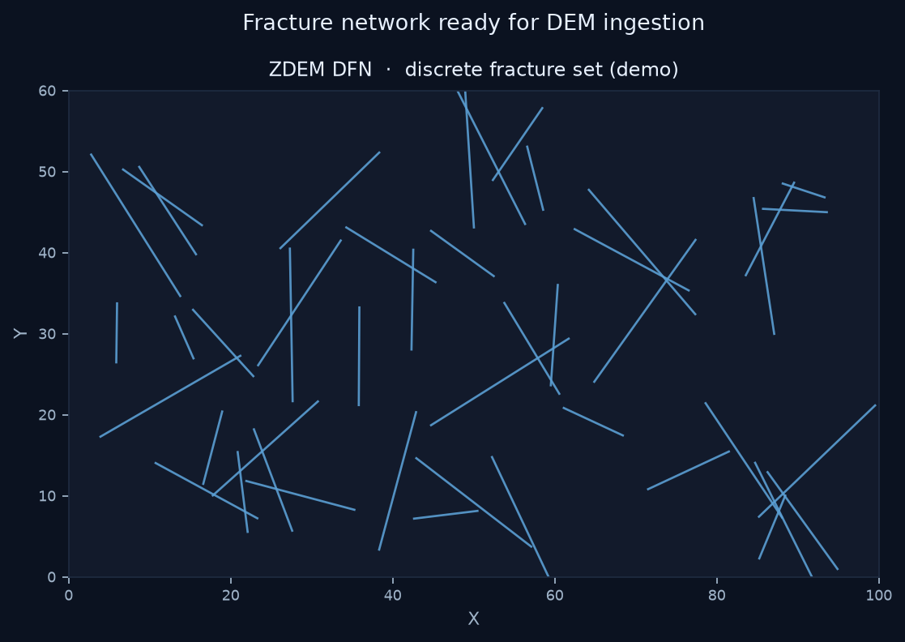

# ZDEM DFN

**Discrete Fracture Network generator helpers for ZDEM workflows.**

[English](README.md) | [中文](README.zh-CN.md)

[](https://github.com/Phoenix0531-sudo/ZDEM_DFN/actions/workflows/ci.yml)
[](LICENSE)

Build fracture sets for DEM ingestion.

## Preview



## Features

- DFN generation helpers under zdem_dfn/
- ZDEM-oriented export conventions
- CI + tests

## Get started

### Install

```bash
git clone https://github.com/Phoenix0531-sudo/ZDEM_DFN.git
cd ZDEM_DFN
pip install -r requirements.txt
```

### Usage

```bash
pytest tests/
```

## Project layout

```
zdem_dfn/
tests/
```

## Related ZDEM tools

| Repo | Role |
|------|------|
| [ZDEM_ParticleTracker](https://github.com/Phoenix0531-sudo/ZDEM_ParticleTracker) | Interactive particle tracking + true-radius render |
| [ZDEM_Salt_Kinematics](https://github.com/Phoenix0531-sudo/ZDEM_Salt_Kinematics) | Salt geometry / kinematics extraction and plots |
| [ZDEM_Area_Conservation](https://github.com/Phoenix0531-sudo/ZDEM_Area_Conservation) | Area-conservation / triangulation analysis |
| [ZDEM_Bond_Fracture](https://github.com/Phoenix0531-sudo/ZDEM_Bond_Fracture) | Bond damage series + visualizer |
| [ZDEM_Damage_Thresholds](https://github.com/Phoenix0531-sudo/ZDEM_Damage_Thresholds) | Damage thresholds and energy plots |
| [ZDEM_DFN](https://github.com/Phoenix0531-sudo/ZDEM_DFN) | Discrete fracture network generator |
| [ZDEM_Model_Editor](https://github.com/Phoenix0531-sudo/ZDEM_Model_Editor) | Model file visual editor |
| [ZDEM_Archiver](https://github.com/Phoenix0531-sudo/ZDEM_Archiver) | Archive / purge bulky dumps |
| [ZDEM3D_WEB](https://github.com/Phoenix0531-sudo/ZDEM3D_WEB) | CAE cloud UI (Django + React + VTK.js) |


## Notes

Validate generated networks against your model geometry constraints.

## License

MIT. Free for commercial use with attribution where applicable. See [LICENSE](LICENSE).
