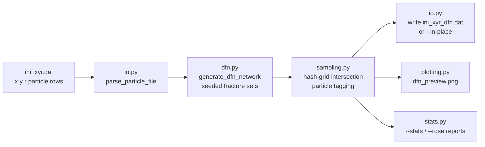

# ZDEM DFN

**ZDEM DFN is a command-line tool for rock-mechanics researchers: it reads ZDEM `ini_xyr.dat` particle files, generates seeded multi-set DFNs, and writes tagged particle outputs plus preview/report artifacts.**

[English](README.md) | [中文](README.zh-CN.md)

[](https://github.com/Phoenix0531-sudo/ZDEM_DFN/actions/workflows/ci.yml)
[](https://github.com/Phoenix0531-sudo/ZDEM_DFN/actions/workflows/ci.yml)
[](https://phoenix0531-sudo.github.io/ZDEM_DFN/)
[](LICENSE)

Build stochastic or controlled **fracture sets** and export conventions oriented to ZDEM model ingestion. Package lives under `zdem_dfn/`. Validate geometry against your experiment box before running DEM.

## Features

- **Multi-set fracture networks** — log-normally distributed trace lengths, per-set dip orientation and intensity (p21), and T-intersection truncation where longer sets cut shorter ones (`config.FRACTURE_SETS`).
- **Seeded reproducibility** — `--seed 42` replays the exact same network; reruns are byte-identical (covered by tests).
- **Fast particle–fracture tagging** — a hash grid shortlists candidates before exact distance tests, replacing the O(P×F) brute-force search (**~11× faster** at 10 000 particles × 400 segments); equivalence with brute force is tested.
- **Mechanism toggles** — heterogeneous material response (asperity / matrix / gouge probabilities) and node penalty, all centralized in `zdem_dfn/config.py`.
- **Safe inspection** — `--dry-run` validates the input and prints the plan without writing particle files, reports or images.
- **Preview rendering** — tagged particle map plus fracture traces as a high-resolution PNG.

## Preview

`dfn_preview.png` as actually written by `python -m zdem_dfn`, rendered
here from a **synthetic demo specimen** (script-generated staggered particle
packing — not laboratory data):


### Parameter gallery

The same synthetic specimen under four `config.FRACTURE_SETS`
configurations (default conjugate sets · single steep joint set · dense
multi-directional web · sparse corridor faults) — rendered by
`python examples/gallery.py`:


## Install / run

```bash
git clone https://github.com/Phoenix0531-sudo/ZDEM_DFN.git
cd ZDEM_DFN
pip install .

# Quick start: bundled synthetic demo (not laboratory data)
python -m zdem_dfn --input examples/demo_case --output outputs/demo_case --seed 42
# outputs/demo_case/ contains ini_xyr_dfn.dat and dfn_preview.png

# Inspect the same case without creating any output:
python -m zdem_dfn --input examples/demo_case --output outputs/demo_case --dry-run

# Batch mode remains available for multiple conditions:
python -m zdem_dfn --dirs path/to/spec1 path/to/spec2 --seed 42

pytest tests/
```

The engine reads each target folder's `ini_xyr.dat` (initial particle
positions), generates the fracture network, and writes tagged particles to
`ini_xyr_dfn.dat`. In the recommended `--input`/`--output` mode, both the
processed file and `dfn_preview.png` are written under the output directory;
the source is never modified. The historical `TARGET_DIRECTORIES` defaults
point at the author's local specimen folders; they are not the recommended
entry point. Use `--input` /
`--output` for a standalone case, or `--dirs` for multiple conditions. See
[data-format.md](docs/data-format.md) for the supported input format.

### CLI reference

| Flag | Meaning |
|---|---|
| `--input DIR` | Recommended single-case input folder containing `ini_xyr.dat` (requires `--output`) |
| `--output DIR` | Required with `--input`; output folder, created automatically |
| `--dirs DIR [DIR …]` | Compatibility batch mode for one or more input folders |
| `--out PATH` | Compatibility preview image path (used with `--dirs`) |
| `--seed N` | RNG seed — same seed, same network |
| `--suffix STR` | Output filename suffix in compatibility mode (default `_dfn`) |
| `--in-place` | Overwrite the source file (legacy behavior; off by default; incompatible with `--input`) |
| `--dry-run` | Validate and print the plan; write no files or images |
| `--stats PATH` | Write network statistics (`.csv` → CSV, otherwise Markdown) |
| `--rose PATH` | Write a fracture-strike rose diagram (PNG) |
| `--verbose` | Print detailed input/output paths and skip reasons |
| `--version` | Print the version and exit |

### Configuring fracture sets

Each entry in `config.FRACTURE_SETS` defines one orientation family:

```python
{
    "set_name": "Secondary_Joints",  # family name
    "p21": 0.001,                    # trace intensity: metres of trace per m² of area
    "length_mult": 3.0,              # mean length = average particle diameter × mult
    "length_std_ratio": 0.3,         # log-normal spread (σ/μ)
    "dip_mean": -45.0,               # dip in degrees (sign sets the sense)
    "dip_std": 5.0,
    "truncation_prob": 0.90,         # chance of being truncated by a longer set (T-intersection)
}
```

Add, remove or reweight entries to compose conjugate patterns — longer
sets truncate shorter ones. All constants and toggles live in
`zdem_dfn/config.py`, the single source of truth for runtime overrides
(assign `zdem_dfn.config.FRACTURE_SETS = [...]` before driving the
pipeline programmatically).

## Data flow


```mermaid
flowchart LR
    A[ini_xyr.dat<br/>x y r particle rows] --> B[io.py<br/>parse_particle_file]
    B --> C[dfn.py<br/>generate_dfn_network<br/>seeded fracture sets]
    C --> D[sampling.py<br/>hash-grid intersection<br/>particle tagging]
    D --> E[io.py<br/>write ini_xyr_dfn.dat<br/>or --in-place]
    D --> F[plotting.py<br/>dfn_preview.png]
    D --> G[stats.py<br/>--stats / --rose reports]
```

### Package layout

Since v1.1 the engine is split into single-responsibility modules;
`zdem_dfn/engine.py` remains as a compatibility facade:

| Module | Responsibility |
|---|---|
| `config.py` | Constants, toggles, fracture set definitions (runtime override point) |
| `geometry.py` | Pure geometry: point-segment distance, Cohen–Sutherland clipping, intersection |
| `dfn.py` | Stochastic fracture network generation (log-normal lengths, dip sets, truncation) |
| `io.py` | `ini_xyr.dat` parsing + tagged output (`ini_xyr_dfn.dat` by default) |
| `sampling.py` | Particle–fracture tagging with hash-grid acceleration |
| `plotting.py` | Preview and rose-diagram rendering (matplotlib) |
| `main.py` | Batch orchestration + CLI (`--dirs/--out/--seed/--dry-run/--stats/--rose/--version`) |
| `stats.py` | Network statistics, dip bins and rose-diagram data |

Pairs with Model Editor (manual structure) and ParticleTracker (post-run geometry).

## Performance

Hash-grid tagging vs brute-force intersection (10 000 particles × 400
segments, 4 000 × 8 000 window, best of 3):

| Method | Time |
|---|---|
| Brute force (O(P×F)) | 1 266 ms |
| Hash grid | **112 ms (11.3×)** |

Reproduce on your machine: `python examples/benchmark_sampling.py`.

## Reproducibility & verification

- **63 tests** (`pytest tests/`): parse round-trip, seeded byte-identical
  reruns, grid-vs-brute-force equivalence, geometry semantics, CLI exit
  codes, end-to-end pipeline, statistics and rose-diagram rendering.
- **CI**: Python 3.10 / 3.13 matrix, lint, coverage (badge above), plus a
  packaging job (wheel build → clean-venv install → import smoke test).
- The committed preview PNG is regenerated deterministically from
  synthetic data — see [examples/](examples/README.md).

## Documentation

An mkdocs-material site with CLI reference, configuration guide and an
auto-generated API reference is built from `docs/` on every push to
`main`: **<https://phoenix0531-sudo.github.io/ZDEM_DFN/>** (local preview:
`mkdocs serve` after `pip install mkdocs-material "mkdocstrings[python]"
mkdocs-gen-files mkdocs-literate-nav mkdocs-section-index`).

## Citing

If this package helps your research, cite it via the repository:

```bibtex
@misc{zdem_dfn,
  title        = {ZDEM\_DFN: Discrete Fracture Network Generator for ZDEM Discrete Element Simulations},
  author       = {Phoenix0531-sudo},
  year         = {2026},
  version      = {1.2.0},
  url          = {https://github.com/Phoenix0531-sudo/ZDEM_DFN},
}
```

(GitHub also exposes a "Cite this repository" button backed by
`CITATION.cff`.)

## License

MIT. See [LICENSE](LICENSE).
