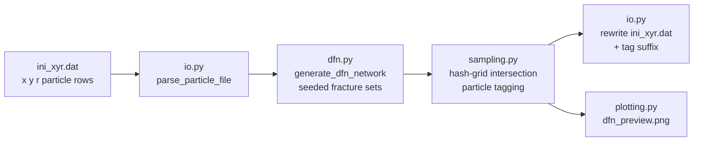

# ZDEM DFN

**Discrete Fracture Network generators for ZDEM model workflows.**

[English](README.md) | [中文](README.zh-CN.md)

[](https://github.com/Phoenix0531-sudo/ZDEM_DFN/actions/workflows/ci.yml)
[](LICENSE)

Build stochastic or controlled **fracture sets** and export conventions oriented to ZDEM model ingestion. Package lives under `zdem_dfn/`. Validate geometry against your experiment box before running DEM.

## Preview

`dfn_preview.png` as actually written by `python -m zdem_dfn`, rendered
here from a **synthetic demo specimen** (script-generated staggered particle
packing — not laboratory data):


Concept schematic (illustration, not engine output):


## Install / run

```bash
git clone https://github.com/Phoenix0531-sudo/ZDEM_DFN.git
cd ZDEM_DFN
pip install -r requirements.txt

# Batch-process folders (each containing a ZDEM particle file ini_xyr.dat),
# rewriting them in place and dropping a preview image:
python -m zdem_dfn --dirs path/to/spec1 path/to/spec2 --seed 42

# Or point the defaults at your folders in zdem_dfn/config.py
# (TARGET_DIRECTORIES / SOURCE_FILENAME / ENABLE_* toggles), then:
python -m zdem_dfn

# Validate / inspect without writing anything:
python -m zdem_dfn --dirs path/to/spec1 --dry-run

pytest tests/
```

The engine reads each target folder's `ini_xyr.dat` (initial particle
positions), generates the fracture network, rewrites the file in place,
and saves `dfn_preview.png` (or `--out PATH`) with tagged particles. Default
`TARGET_DIRECTORIES` point at the author's local specimen folders —
override them with `--dirs` or edit `zdem_dfn/config.py`.

### Data flow


```mermaid
flowchart LR
    A[ini_xyr.dat<br/>x y r particle rows] --> B[io.py<br/>parse_particle_file]
    B --> C[dfn.py<br/>generate_dfn_network<br/>seeded fracture sets]
    C --> D[sampling.py<br/>hash-grid intersection<br/>particle tagging]
    D --> E[io.py<br/>rewrite ini_xyr.dat<br/>+ tag suffix]
    D --> F[plotting.py<br/>dfn_preview.png]
```

### Package layout

Since v1.1 the engine is split into single-responsibility modules;
`zdem_dfn/engine.py` remains as a compatibility facade:

| Module | Responsibility |
|---|---|
| `config.py` | Constants, toggles, fracture set definitions (runtime override point) |
| `geometry.py` | Pure geometry: point-segment distance, Cohen–Sutherland clipping, intersection |
| `dfn.py` | Stochastic fracture network generation (log-normal lengths, dip sets, truncation) |
| `io.py` | `ini_xyr.dat` parsing + tagged in-place rewrite |
| `sampling.py` | Particle-fracture tagging with hash-grid acceleration |
| `plotting.py` | Preview rendering (matplotlib) |
| `main.py` | Batch orchestration + CLI (`--dirs/--out/--seed/--dry-run/--version`) |

Pairs with Model Editor (manual structure) and ParticleTracker (post-run geometry).

## License

MIT. See [LICENSE](LICENSE).
