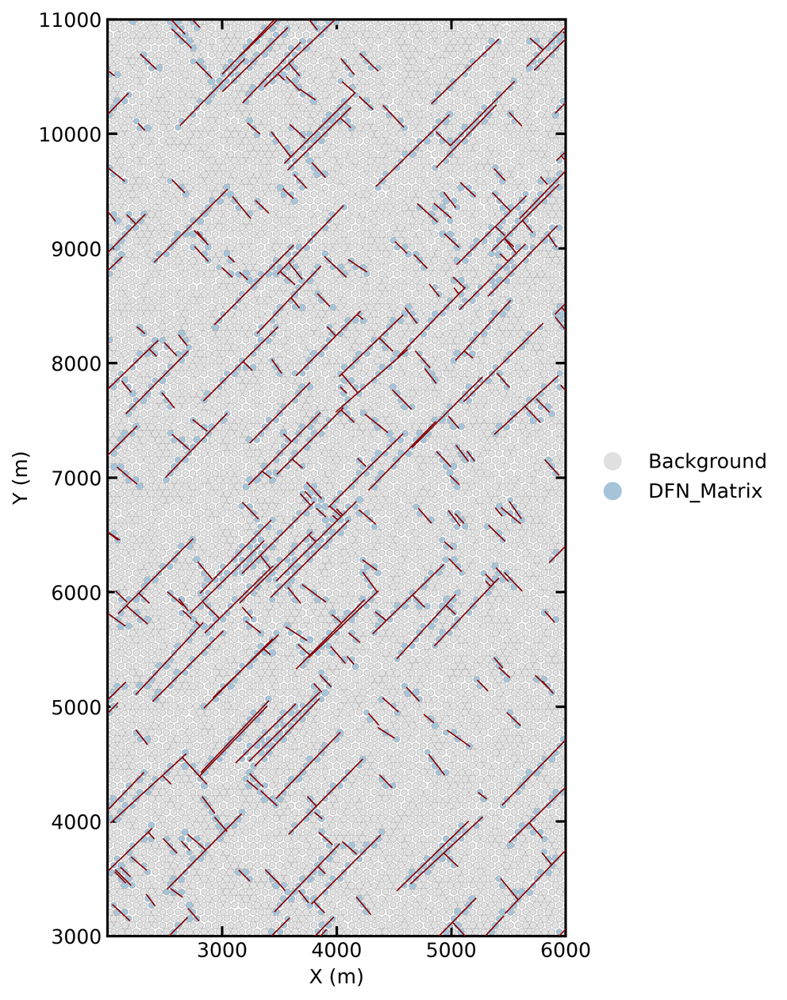
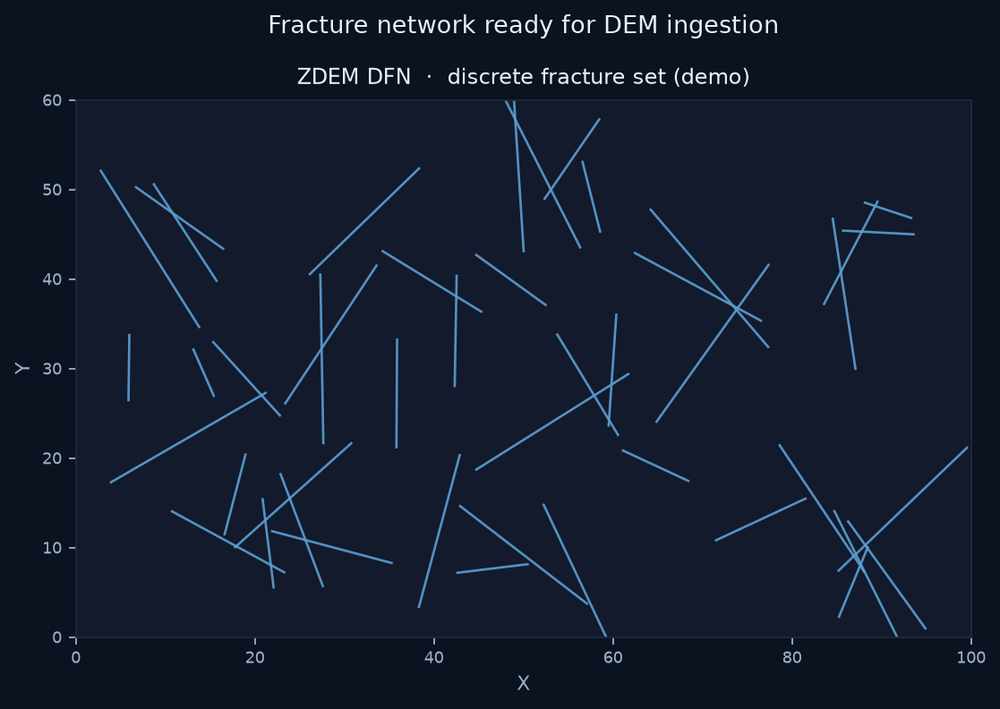

# ZDEM DFN

**Discrete Fracture Network generators for ZDEM model workflows.**

[English](README.md) | [中文](README.zh-CN.md)

[](https://github.com/Phoenix0531-sudo/ZDEM_DFN/actions/workflows/ci.yml)
[](LICENSE)

Build stochastic or controlled **fracture sets** and export conventions oriented to ZDEM model ingestion. Package lives under `zdem_dfn/`. Validate geometry against your experiment box before running DEM.

## Preview

`dfn_preview.png` as actually written by `python -m zdem_dfn`, rendered
here from a **synthetic demo specimen** (script-generated staggered particle
packing — not laboratory data):



Concept schematic (illustration, not engine output):



## Install / run

```bash
git clone https://github.com/Phoenix0531-sudo/ZDEM_DFN.git
cd ZDEM_DFN
pip install -r requirements.txt

# 1. Point TARGET_DIRECTORIES at folders that each contain a ZDEM
#    particle file (ini_xyr.dat); tune SOURCE_FILENAME and the
#    ENABLE_* toggles at the top of zdem_dfn/engine.py.
# 2. Batch-process every folder in place and drop a preview image:
python -m zdem_dfn

pytest tests/
```

The engine reads each target folder's `ini_xyr.dat` (initial particle
positions), generates the fracture network, rewrites the file in place,
and saves `dfn_preview.png` to the current directory. Default
`TARGET_DIRECTORIES` point at the author's local specimen folders —
edit them before running.

Pairs with Model Editor (manual structure) and ParticleTracker (post-run geometry).

## License

MIT. See [LICENSE](LICENSE).
