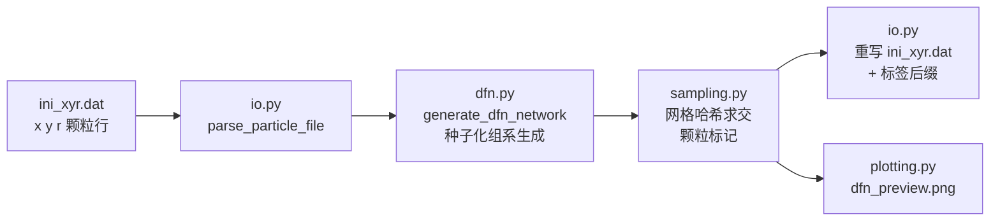

# ZDEM DFN

**面向 ZDEM 工作流的离散裂隙网络（DFN）生成。**

[English](README.md) | [中文](README.zh-CN.md)

[](https://github.com/Phoenix0531-sudo/ZDEM_DFN/actions/workflows/ci.yml)
[](LICENSE)

包在 `zdem_dfn/`。生成后按实验盒子几何自行校验，再导入 DEM。

## 预览

`python -m zdem_dfn` 实际落地的 `dfn_preview.png`，由**合成演示数据**
（脚本生成的交错颗粒填充，非实验数据）渲染：


概念示意图（Illustration，非引擎输出）：


```bash
pip install -r requirements.txt

# 批处理各文件夹（每个含 ZDEM 颗粒文件 ini_xyr.dat），就地覆写并输出预览图：
python -m zdem_dfn --dirs 路径/样品1 路径/样品2 --seed 42

# 或在 zdem_dfn/config.py 里把默认值指向你的文件夹
# （TARGET_DIRECTORIES / SOURCE_FILENAME / ENABLE_* 开关），然后：
python -m zdem_dfn

# 不写任何文件，仅校验 / 检查：
python -m zdem_dfn --dirs 路径/样品1 --dry-run

pytest tests/
```

引擎读取各目标文件夹的 `ini_xyr.dat`（初始颗粒坐标），生成裂隙网络后
就地覆写该文件，并输出带标签颗粒的 `dfn_preview.png`（或 `--out 路径`）。
默认 `TARGET_DIRECTORIES` 指向作者本机样品目录——用 `--dirs` 覆盖，或编辑
`zdem_dfn/config.py`。

### 数据流



### 包结构

v1.1 起引擎拆分为职责单一的模块；`zdem_dfn/engine.py` 保留为兼容门面：

| 模块 | 职责 |
|---|---|
| `config.py` | 常量、开关、裂隙组系定义（运行时覆盖入口） |
| `geometry.py` | 纯几何：点线距、Cohen–Sutherland 裁剪、求交 |
| `dfn.py` | 随机裂隙网络生成（对数正态长度、倾向组系、截断交接） |
| `io.py` | `ini_xyr.dat` 解析 + 带标签就地覆写 |
| `sampling.py` | 颗粒-裂隙标记（网格哈希加速） |
| `plotting.py` | 预览图渲染（matplotlib） |
| `main.py` | 批处理编排 + CLI（`--dirs/--out/--seed/--dry-run/--version`） |

## 许可证

MIT。详见 [LICENSE](LICENSE)。
