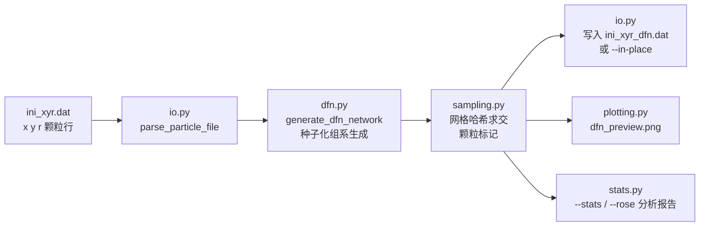

# ZDEM DFN

**ZDEM DFN 是面向岩石力学研究者的命令行工具：读取 ZDEM `ini_xyr.dat` 颗粒文件，生成可复现的多组系 DFN，并输出带标签颗粒文件、预览图和统计报告。**

[English](README.md) | [中文](README.zh-CN.md)

[](https://github.com/Phoenix0531-sudo/ZDEM_DFN/actions/workflows/ci.yml)
[](https://github.com/Phoenix0531-sudo/ZDEM_DFN/actions/workflows/ci.yml)
[](https://phoenix0531-sudo.github.io/ZDEM_DFN/)
[](LICENSE)

包在 `zdem_dfn/`。生成后按实验盒子几何自行校验，再导入 DEM。

## 特性

- **多组系裂隙网络** — 对数正态迹长、组系倾向与强度（p21）、长组系对短组系的 T 型截断交接（`config.FRACTURE_SETS`）。
- **种子可复现** — `--seed 42` 精确重放同一网络；重跑结果逐字节一致（有测试覆盖）。
- **快速颗粒-裂隙标记** — 网格哈希先粗筛候选、再做精确距离判定，替代 O(P×F) 暴力求交（10 000 颗粒 × 400 段约 **快 11 倍**）；与暴力法等价有测试。
- **机制开关** — 非均质响应（asperity / matrix / gouge 概率）与节点罚函数，全部集中在 `zdem_dfn/config.py`。
- **安全检查** — `--dry-run` 校验输入并打印处理计划，不写入颗粒文件、报告或图片。
- **预览渲染** — 带标记颗粒图 + 裂隙迹线，高分辨率 PNG。

## 预览

`python -m zdem_dfn` 实际落地的 `dfn_preview.png`，由**合成演示数据**
（脚本生成的交错颗粒填充，非实验数据）渲染：


### 参数图库

同一合成样品在四种 `config.FRACTURE_SETS` 配置下（默认共轭组系 · 单一陡倾角组系 · 密集多向网状 · 稀疏长廊道断层）——`python examples/gallery.py` 渲染：


## 安装 / 运行

```bash
pip install .

# 快速开始：仓库自带合成演示数据（不代表真实实验结果）
python -m zdem_dfn --input examples/demo_case --output outputs/demo_case --seed 42
# outputs/demo_case/ 中会生成 ini_xyr_dfn.dat 和 dfn_preview.png

# 只检查、不创建任何输出：
python -m zdem_dfn --input examples/demo_case --output outputs/demo_case --dry-run

# 多工况批处理仍可使用兼容接口：
python -m zdem_dfn --dirs 路径/样品1 路径/样品2 --seed 42

pytest tests/
```

引擎读取各目标文件夹的 `ini_xyr.dat`（初始颗粒坐标），生成裂隙网络后
将带标签颗粒写入 `ini_xyr_dfn.dat`。推荐的 `--input`/`--output` 模式会把
处理文件与 `dfn_preview.png` 统一写入输出目录，源文件永不被修改。历史 `TARGET_DIRECTORIES` 默认值指向作者本机样品目录，不是推荐入口。单个工况请使用
`--input` / `--output`，多工况请使用 `--dirs`。输入格式详见
[data-format.md](docs/data-format.md)。

### CLI 参数

| 参数 | 说明 |
|---|---|
| `--input 目录` | 推荐的单工况输入目录，内含 `ini_xyr.dat` |
| `--output 目录` | 推荐的输出目录；写入 `ini_xyr_dfn.dat` 与 `dfn_preview.png` |
| `--dirs 目录 [目录 …]` | 兼容的多工况批处理接口 |
| `--out 路径` | 兼容接口的预览图输出路径（与 `--dirs` 配合） |
| `--seed N` | 随机种子——同种子同网络 |
| `--suffix STR` | 兼容接口的输出文件名后缀（默认 `_dfn`） |
| `--in-place` | 覆写源文件（旧版行为；默认关闭；不能与 `--input` 同用） |
| `--dry-run` | 校验并打印计划；不写任何文件或图片 |
| `--stats PATH` | 写网络统计（`.csv` 写 CSV，否则写 Markdown） |
| `--rose PATH` | 写裂隙走向玫瑰图（PNG） |
| `--verbose` | 打印详细输入/输出路径和跳过原因 |
| `--version` | 打印版本号后退出 |

### 配置裂隙组系

`config.FRACTURE_SETS` 的每个条目定义一个倾向组系：

```python
{
    "set_name": "Secondary_Joints",  # 组系名
    "p21": 0.001,                    # 迹线强度：每 m² 面积内的迹线总长（m）
    "length_mult": 3.0,              # 平均迹长 = 颗粒平均直径 × 倍数
    "length_std_ratio": 0.3,         # 对数正态离散度（σ/μ）
    "dip_mean": -45.0,               # 倾角（度），正负号定倾向
    "dip_std": 5.0,
    "truncation_prob": 0.90,         # 被更长组系截断（T 型交接）的概率
}
```

增删条目或调整权重即可组合共轭裂隙模式——长组系会截断短组系。
所有常量与开关集中在 `zdem_dfn/config.py`，是运行时覆盖的唯一事实来源
（在程序化调用管线前，直接对 `zdem_dfn.config.FRACTURE_SETS` 赋值即可）。

## 数据流



### 包结构

v1.1 起引擎拆分为职责单一的模块；`zdem_dfn/engine.py` 保留为兼容门面：

| 模块 | 职责 |
|---|---|
| `config.py` | 常量、开关、裂隙组系定义（运行时覆盖入口） |
| `geometry.py` | 纯几何：点线距、Cohen–Sutherland 裁剪、求交 |
| `dfn.py` | 随机裂隙网络生成（对数正态长度、倾向组系、截断交接） |
| `io.py` | `ini_xyr.dat` 解析 + 带标签输出（默认 `ini_xyr_dfn.dat`） |
| `sampling.py` | 颗粒-裂隙标记（网格哈希加速） |
| `plotting.py` | 预览图与玫瑰图渲染（matplotlib） |
| `main.py` | 批处理编排 + CLI（`--dirs/--out/--seed/--dry-run/--stats/--rose/--version`） |
| `stats.py` | 网络统计、方向角分箱与玫瑰图数据 |

与 Model Editor（手工建模）、ParticleTracker（跑后几何）配合使用。

## 性能

网格哈希标记 vs 暴力求交（10 000 颗粒 × 400 段，4 000 × 8 000 窗口，取 3 次最优）：

| 方法 | 耗时 |
|---|---|
| 暴力求交（O(P×F)） | 1 266 ms |
| 网格哈希 | **112 ms（11.3×）** |

在你自己的机器上复现：`python examples/benchmark_sampling.py`。

## 可复现性与验证

- **63 项测试**（`pytest tests/`）：解析回读、种子逐字节重跑一致性、
  网格与暴力法等价、几何语义、CLI 退出码、端到端管线、统计与玫瑰图渲染。
- **CI**：Python 3.10 / 3.13 矩阵、lint、覆盖率（见顶部徽章），外加打包任务
  （wheel 构建 → 干净 venv 安装 → 导入冒烟）。
- README 预览图由合成数据确定性重生成——见 [examples/](examples/README.md)。

## 文档站

mkdocs-material 文档站（CLI 参考、组系配置指南、自动生成 API 文档）随
`main` 分支每次推送自动构建部署：
**<https://phoenix0531-sudo.github.io/ZDEM_DFN/>**（本地预览：装好
`mkdocs-material "mkdocstrings[python]" mkdocs-gen-files mkdocs-literate-nav
mkdocs-section-index` 后运行 `mkdocs serve`）。

## 引用

若本包对你的研究有帮助，请引用本仓库（GitHub 的 "Cite this repository"
按钮由 `CITATION.cff` 驱动）：

```bibtex
@misc{zdem_dfn,
  title        = {ZDEM\_DFN: Discrete Fracture Network Generator for ZDEM Discrete Element Simulations},
  author       = {Phoenix0531-sudo},
  year         = {2026},
  version      = {1.2.0},
  url          = {https://github.com/Phoenix0531-sudo/ZDEM_DFN},
}
```

## 许可证

MIT。详见 [LICENSE](LICENSE)。
