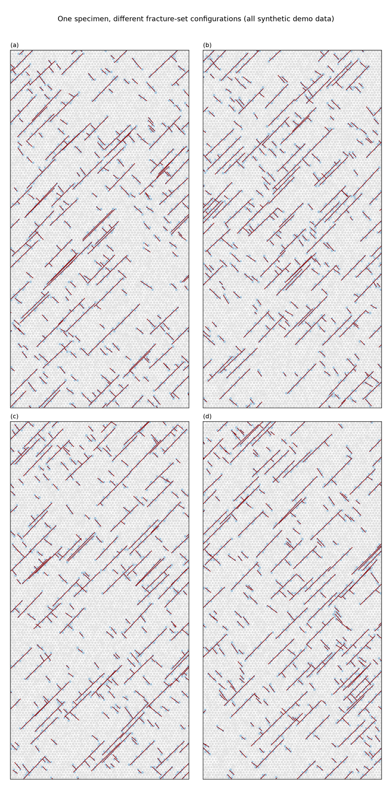

# Usage

## CLI

```
python -m zdem_dfn [--dirs DIR [DIR ...]] [--out PATH] [--seed SEED]
                   [--dry-run] [--version]
```

| Flag | Meaning |
|---|---|
| `--dirs DIR [DIR …]` | Target folders, each containing an `ini_xyr.dat` (default: `config.TARGET_DIRECTORIES`) |
| `--out PATH` | Preview image output path (default `dfn_preview.png` in the current directory) |
| `--seed N` | RNG seed — same seed, same network |
| `--dry-run` | Parse and generate only; write nothing, render nothing |
| `--version` | Print the version and exit |

Exit codes: `0` success, `1` configuration error (no directories / missing
reference file / no valid particles), `2` every target directory missing.

## Fracture-set configuration

Each entry in `zdem_dfn/config.FRACTURE_SETS` defines one orientation family:

```python
{
    "set_name": "Secondary_Joints",  # family name
    "p21": 0.001,                    # trace intensity: m of trace per m² of area
    "length_mult": 3.0,              # mean length = average particle diameter × mult
    "length_std_ratio": 0.3,         # log-normal spread (σ/μ)
    "dip_mean": -45.0,               # dip in degrees (sign sets the sense)
    "dip_std": 5.0,
    "truncation_prob": 0.90,         # chance of being truncated by a longer set
}
```

Longer sets truncate shorter ones (T-intersections). Add, remove or reweight
entries to compose conjugate patterns.

## Examples

### Parameter gallery

```bash
python examples/gallery.py --out docs/screenshots/dfn_gallery.png
```

Renders the same synthetic specimen under four fracture-set configurations
(default, single steep set, dense web, sparse corridor faults):



### Hash-grid vs brute-force benchmark

```bash
python examples/benchmark_sampling.py
```

Hash-grid tagging beats the O(P×F) brute-force search (~11× at 10 000
particles × 400 segments) with tested tag equivalence.

### Programmatic use

```python
import random
import zdem_dfn.config as config
from zdem_dfn.main import run_batch

config.TARGET_DIRECTORIES = ["path/to/specimen"]  # runtime override
random.seed(42)
run_batch()
```

!!! note
    Read config values through the module (`config.CROP_MIN_X`), never
    `from config import CROP_MIN_X`, so runtime overrides keep working.
